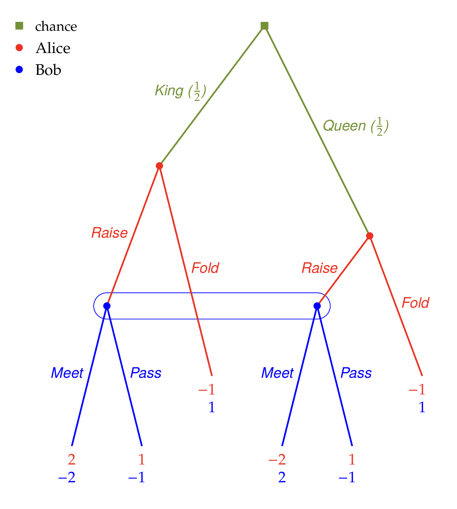

# draw_tree

🚨 NOTE FOR POTENTIAL CONTRIBUTORS 🚨

This package is at an early stage of development; please read the Gambit project's [contributor guidance](https://gambitproject.readthedocs.io/en/latest/developer.contributing.html).

## Table of contents

- [What does this package do?](#what-does-this-package-do)
- [Installation](#installation)
- [Requirements](#requirements)
- [CLI](#cli)
- [Python API](#python-api)
    - [Rendering in Jupyter Notebooks](#rendering-in-jupyter-notebooks)
    - [Interoperability with pygambit](#interoperability-with-pygambit)
- [Developer docs](#developer-docs)
    - [Testing](#testing)
    - [Releases](#releases)

## What does this package do?

`draw_tree` is a game tree drawing tool for publication-ready extensive form games in Game Theory.
It can generate TikZ code, LaTeX documents, PDFs, PNGs, and SVGs from game specifications.

Games can be specified via `.ef` format files which include layout formatting.
These can be created via [Game Theory Explorer](https://gametheoryexplorer-a68c7.web.app/), or by hand, see [specs.pdf](specs.pdf) for details.

Games can alternatively be specified via `pygambit` game objects; see the [Interoperability with pygambit](#interoperability-with-pygambit) section below for details, or read tutorial in the Gambit documentation: [Tutorial 4) Creating publication-ready game images](https://gambitproject.readthedocs.io/en/latest/tutorials/04_creating_images.html).

> `draw_tree` was originally developed by [Bernhard von Stengel](https://www.lse.ac.uk/people/bernhard-von-stengel) at the London School of Economics. It is being developed further as part of the [Gambit project](https://www.gambit-project.org) out of The Alan Turing Institute.



## Installation

Clone the repo and install the package using pip:

```bash
git clone https://github.com/gambitproject/draw_tree
cd draw_tree
pip install -e .
```

## Requirements

- Python 3.10+ (tested on 3.13)
- LaTeX with TikZ (for PDF/PNG/SVG generation)
- (optional) ImageMagick or Ghostscript or Poppler (for PNG generation)
- (optional) pdf2svg (for SVG generation)

### Installing LaTeX

Note: PDF, PNG and SVG generation require `pdflatex` to be installed and available in PATH. Tested methods have a ✅ next to them. Methods include:

- macOS:
    - Install [MacTEX](https://www.tug.org/mactex/mactex-download.html) ✅
    - `brew install --cask mactex`
- Ubuntu:
    - `sudo apt-get install texlive-full` ✅
- Windows: Install [MiKTeX](https://miktex.org/download)

### PNG generation

PNG generation will default to using any of ImageMagick or Ghostscript or Poppler that are installed. If none are installed, try one of the following:
- macOS:
    - `brew install imagemagick`
    - `brew install ghostscript`
    - `brew install poppler`
- Ubuntu:
    - `sudo apt-get install imagemagick`
    - `sudo apt-get install ghostscript`
    - `sudo apt-get install poppler-utils`
- Windows: Install ImageMagick or Ghostscript from their websites

### SVG generation

SVG generation requires `pdf2svg` to be installed and available in PATH.
- macOS:
    - `brew install pdf2svg` ✅
- Ubuntu:
    - `sudo apt-get install pdf2svg`
- Windows: Download binaries from [GitHub](https://github.com/dawbarton/pdf2svg)

## CLI

By default, `draw_tree` generates TikZ code and prints it to standard output.
There are also options to generate a complete LaTeX document, a PDF or a PNG directly, either by specifying the desired format or by using the output filename extension:

```bash
draw_tree games/example.ef                                 # Prints TikZ code to stdout
draw_tree games/example.ef --tex                           # Creates example.tex
draw_tree games/example.ef --output=custom.tex             # Creates custom.tex
draw_tree games/example.ef --pdf                           # Creates example.pdf
draw_tree games/example.ef --png                           # Creates example.png
draw_tree games/example.ef --svg                           # Creates example.svg
draw_tree games/example.ef --png --dpi=600                 # Creates high-res example.png (72-2400, default: 300)
draw_tree games/example.ef --output=mygame.png scale=0.8   # Creates mygame.png with 0.8 scaling (0.01 to 100)
```

## Python API

You can also use `draw_tree` as a Python library:

```python
from draw_tree import generate_tex, generate_pdf, generate_png, generate_svg
generate_tex('games/example.ef')                                    # Creates example.tex
generate_tex('games/example.ef', save_to='custom')                  # Creates custom.tex
generate_pdf('games/example.ef')                                    # Creates example.pdf
generate_png('games/example.ef')                                    # Creates example.png
generate_svg('games/example.ef')                                    # Creates example.svg
generate_png('games/example.ef', dpi=600)                           # Creates high-res example.png (72-2400, default: 300)
generate_png('games/example.ef', save_to='mygame', scale_factor=0.8)    # Creates mygame.png with 0.8 scaling (0.01 to 100)
```

### Rendering in Jupyter Notebooks

In a Jupyter notebook, run:

```python
from draw_tree import draw_tree
draw_tree('games/example.ef')
```

Take a look in the `tutorial/` folder for example notebooks.

> ⚠️ Warning: Images do not render correctly in notebooks opened in VSCode; open notebooks in Jupyter Lab.

### Interoperability with pygambit

Check out the `pygambit` documentation which contains tutorials that use `draw_tree` to render game trees from `pygambit` game objects.

In particular read [Tutorial 4) Creating publication-ready game images](https://gambitproject.readthedocs.io/en/latest/tutorials/04_creating_images.html).

In short, you can do:
```python
import pygambit as gbt
from draw_tree import draw_tree, generate_tex, generate_pdf, generate_png, generate_svg
g = gbt.read_efg('somegame.efg')
draw_tree(g)
generate_tex(g)
generate_pdf(g)
generate_png(g)
generate_svg(g)
```

> Note: Without setting the `save_to` parameter, the saved file will be based on the title field of the pygambit game object.

## Developer docs

### Testing

The project includes a comprehensive test suite using pytest. To run the tests:

Run all tests:
```bash
pytest tests/ -v
```

Run tests with coverage:
```bash
pytest tests/ --cov=draw_tree --cov-report=html
```

### Releases

To release a new version of `draw_tree`, update the version number in `pyproject.toml` and in `src/draw_tree/__init__.py`.

After the change is pushed to the main branch, push a tag:

```
git tag vX.X.X
git push origin tag vX.X.X
```

Then make the release on GitHub based on that tag.